这个项目是大三小学期时我和我的两个小伙伴在非常短的时间内一起做的一个项目，经队友同意，分享给大家~。

后台是纯原生的前端三件套，还有一个小程序端。后端用的是flask框架。

# 一、项目介绍

## 1. 项目背景

中草药作为中国传统医学的重要组成部分，具有悠久的历史和丰富的文化内涵。随着现代科技的发展，中草药的研究与应用得到了前所未有的关注和重视。然而，由于中草药种类繁多，形态各异，许多人对中草药的认识和辨识能力有限，这在一定程度上限制了中草药的普及和应用。

为了更好地保护和传承中草药文化，并推动其现代化发展，开发一个智能化的中草药识别系统显得尤为重要。通过运用先进的图像识别技术和人工智能算法，该系统可以帮助用户快速、准确地识别15种日常常见的中草药，提供详细的中草药信息。

## 2. 项目功能

1. 识别15种中草药：

利用先进的图像识别技术，用户可以通过上传中草药的照片来快速识别具体的中草药种类。系统将会从数据库中识别并返回相应的中草药名称和信息。

2. 15种中草药信息获取：

提供每种中草药的详细信息，包括中草药的描述、药效等。

3. 用户修改信息功能：

用户可以修改自己个人信息，包括用户名、头像等。

4. 后台查看用户信息：

后台可以查看用户总数、历史识别总数、今日识别总数、5日以内搜索使用情况、每类搜索记录等。

## 3. 应用场景

1. 智能药房：该数据集可以用于训练和测试中药材识别模型，帮助医药从业者快速、准确地识别中药材。

2. 教学与研究：在中医药教育领域，通过中药图像识别技术，可以为学生提供直观的学习材料，帮助他们更好地理解和掌握中药知识。

3. 电商平台：在中药材电商平台上，辅助买家进行中药材的快速检索和识别，提高购物体验。

4. 健康咨询：在健康咨询平台上，用户可以通过上传中药图片，快速获取该中药的基本信息和功效介绍，增强健康意识。

# 二、项目设计

## 1. 功能模块图

## 2.  数据库设计

下面是数据库的er图，标红的为主键：

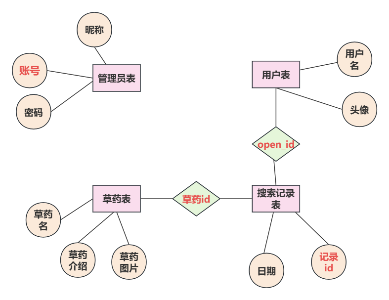

## 3. 系统流程图

小程序端系统流程图

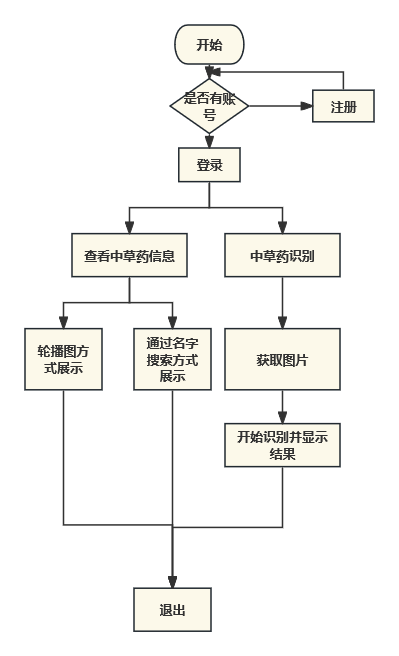

后台系统流程图

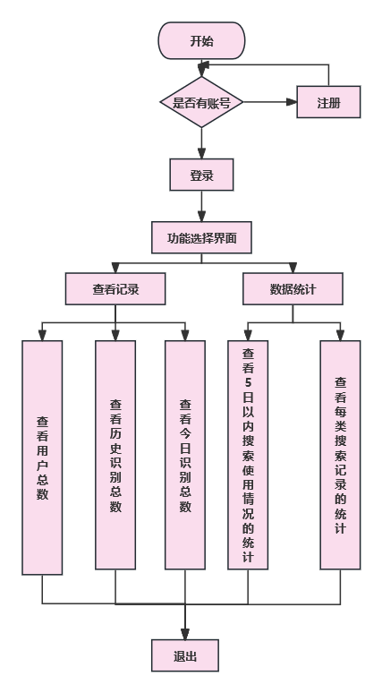

## 4. 流程图（基于用户）

小程序端

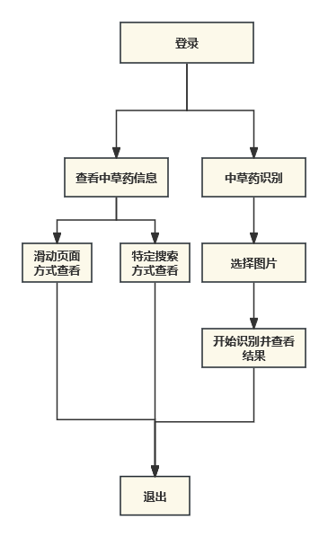

后台

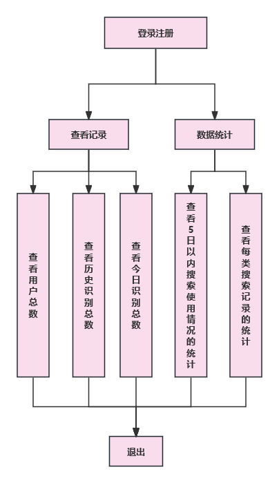

# 三、数据集介绍

## 1. 数据量

数据集共计15种中药材数据，每种药材均采集了250张左右的图像。每条记录包含图像以及对应中药材种类名称。

## 2. 类别个数

数据集涉及15种中药材，具体为九层塔、冬虫夏草、干枸杞、当归、无花果、柿蒂、槐花、罗汉果、艾叶、芦荟、苍耳子、车前草、金钱草、金银花及陈皮。

# 四、项目界面

## 1. 小程序端

1. 首页

   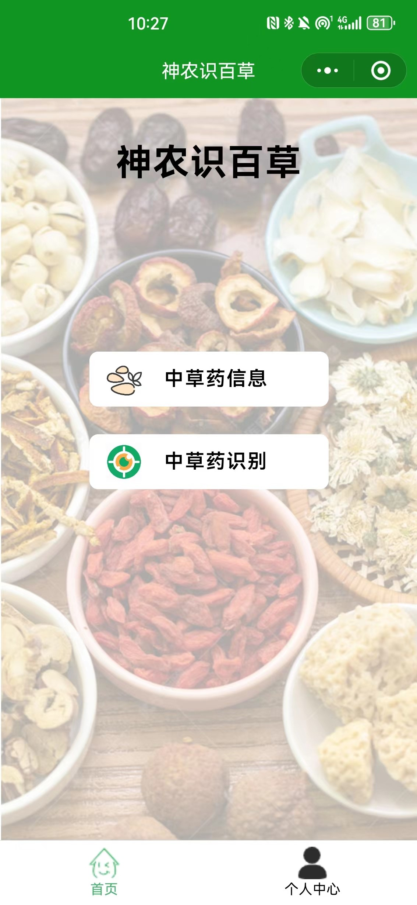

2. 草药信息界面

   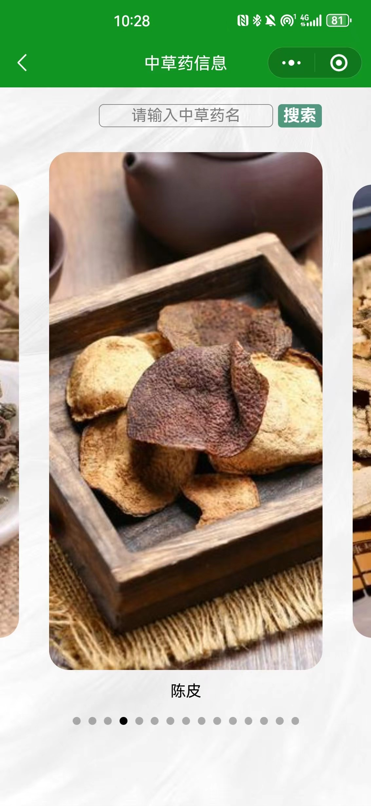

   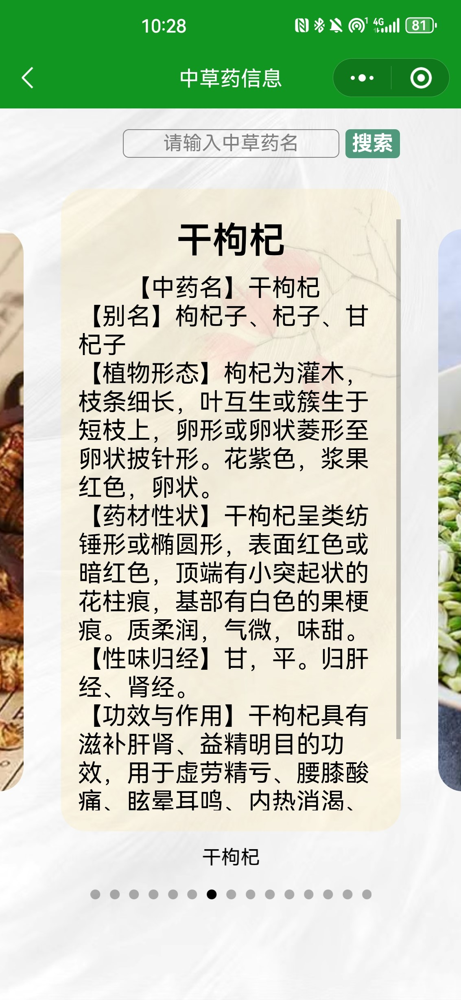

3. 草药识别界面

   

   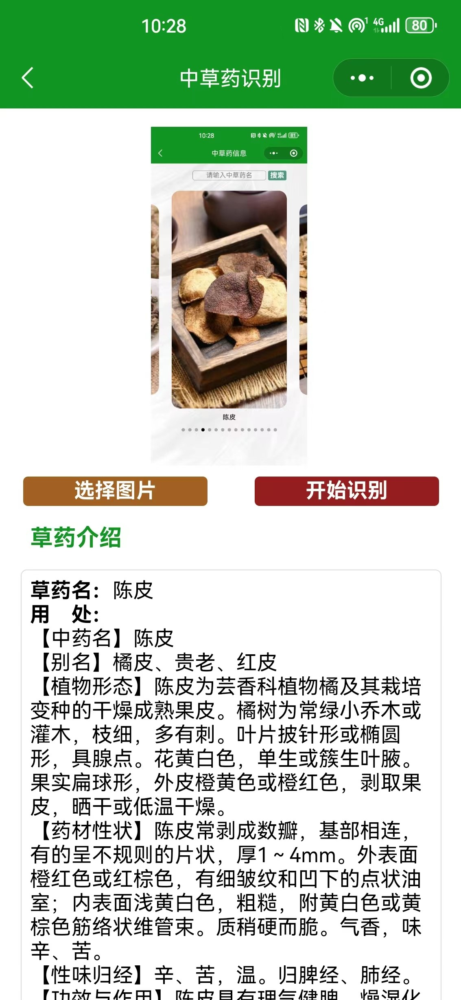

   

4. 个人信息界面

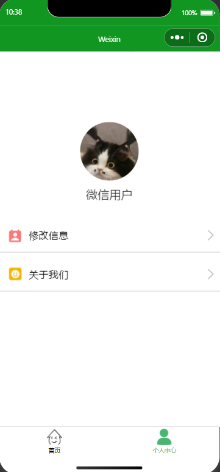

## 2. 后台

1. 登录

   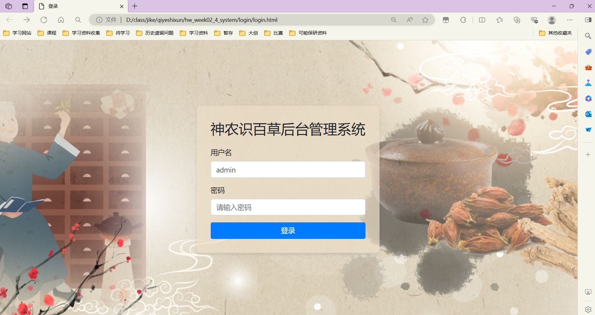

2. 首页

   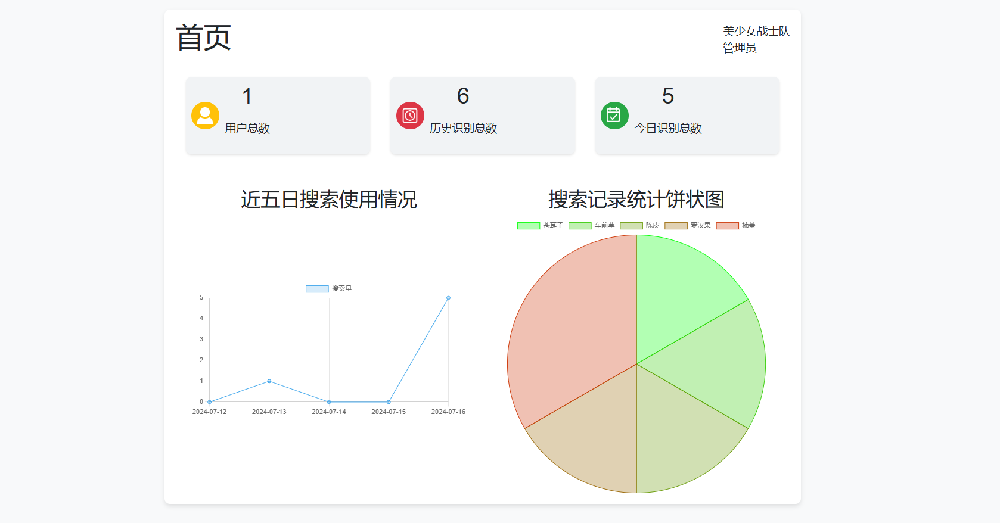

# 四、项目运行

1. 后端修改

   在config文件中，修改数据库相关配置和微信小程序相关配置

2. 小程序端修改

   小程序发起请求的p地址和端口设置在app.js中，只需修改这一个就行。

3. 后台代码修改

    两个界面中一共发起过两次请求，ip为本机，端口是5000

4. 另外

   数据库中，草药信息的图片是云存储的地址，几个月之后应该就会失效。因此，我把这些图片整理出来统一放到了 草药信息图片 目录下。

# 五、关于模型

最优模型，数据集，最优模型训练代码全部都在在/backend/AI文件夹中

